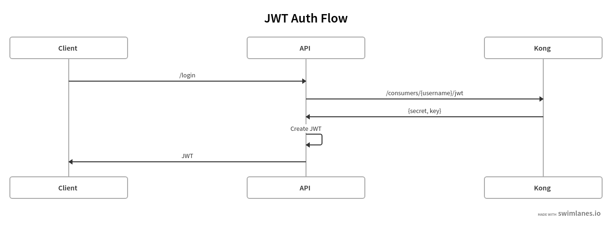

# Kong Demo

By following this guide you will deploy a mocked banking API, expose it via the Kong API gateway. It will demonstrate the following Kong features:
* API Proxy
* Load balancing
* Consumers
* File Log
* JWT
* ACL

## Prerequisites

Install JSON server for mocking endpoints:
``` bash
npm install -g json-server
```

Create an entry in `/etc/hosts`:
```
127.0.0.1   api.modefin.com
```

## Server Setup

Run two JSON server instances, which will answer to `/accounts` and `/payments`:
``` bash
json-server --watch db.json --middlewares logger.js --port 3000
json-server --watch db.json --middlewares logger.js --port 3001
```

Run Kong and Cassandra:
``` bash
docker-compose up
```

Afterwards import the `Kong.postman_collection.json` into Postman.

## Running the Postman Collection

Execute all requests in the **Setup...** folders one after another. Remember to store the output of the **Create JWT** requests, as it contains the information which is required to generate JWTs afterwards, e.g.
``` json
{
    "secret": "EeJvCSslK5PQaToOwb3Gn5h7sygikrqf",
    "key": "snJv2d02Llv6rcbI7tJRzwwH2LIybRyF",
    "consumer": {
        "id": "5f39bf25-ff19-4675-851e-caf95b39b9b3"
    },
    "rsa_public_key": null,
    "created_at": 1620823373,
    "algorithm": "HS256",
    "tags": null,
    "id": "1343748c-787d-4b53-8e9e-8aa8f0856cf0"
}
```

In order to access the APIs behind the gateway, you need to generate JWTs for the example users Joe and Judy. Therefore, navigate to https://jwt.io and add the following information:
**Payload**
``` json
{
  "iss": "<key-from-previous-step>"
}
```

**your-256-bit-secret**
```
<secret-from-previous-step>
```

Afterwards copy the resulting JWT and copy it into the `Authorization` header of the examples.

## JWT Authentication Flow

In a real world API, JWT authentication should be implemented as following:


